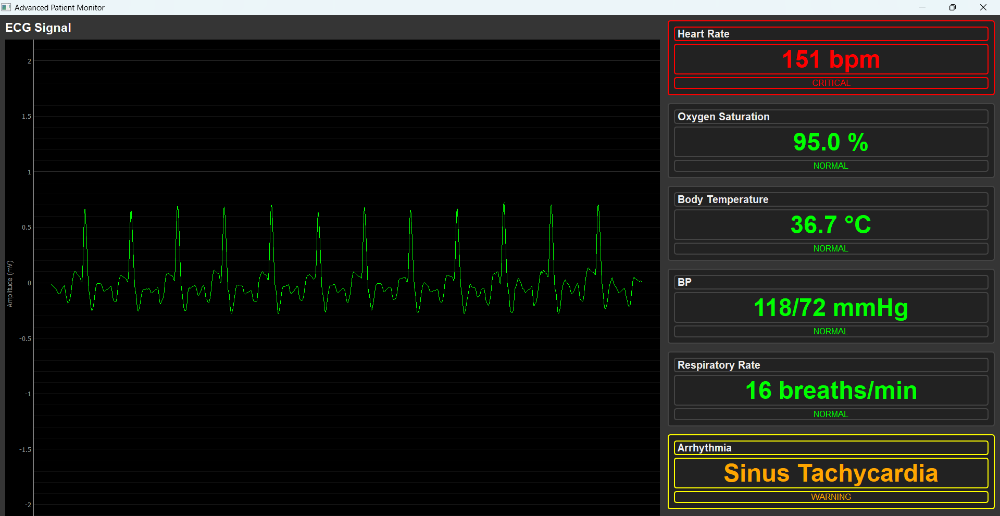

# 🩺 Patient Monitoring System - Real-Time ECG Analysis


## 📋 Project Overview
This project presents a real-time Patient Monitoring System equipped with a Graphical User Interface (GUI) to display and analyze **Electrocardiogram (ECG) signals**. The system incorporates algorithms for automatic detection and classification of at least **three arrhythmias**, triggering alerts for any abnormal heart rhythms.

---

## 🚀 Features
- 📈 Recorded ECG signal visualization
- ⚠️ Automatic detection and classification of:
  - Premature Ventricular Contractions (PVC)
  - Bradycardia
  - Tachycardia
- 🔊 Audio-visual alarm alerts
- 💻 Professional-grade GUI for real-time clinical use


---


---

## 📷 GUI Snapshots

| Real-Time ECG Display | Arrhythmia Alert |
|------------------------|------------------|
|  |  |


---

## 🧠 Arrhythmia Detection Logic
The detection system uses a combination of:
- **R-peak detection**
- **RR interval variability**


Each arrhythmia is classified using a machine learning model trained on preprocessed datasets such as **MIT-BIH Arrhythmia Database**.

---

## 🛠️ How to Run
```bash
# Clone the repository
$ git clone https://github.com/PavlyAwad/Task1-PatientMonitor.git

# Run the application
$ python main.py
```

> Place ECG signal files in the `/ECG Data` directory, or connect a live ECG source if supported.

---


## 👨‍💼 Contributors
- **[Your Name]** –
- **[Team Member 2]** 
- **[Team Member 3]** 


